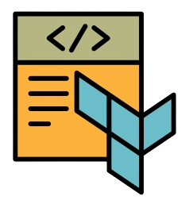
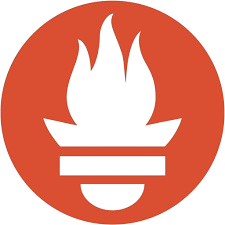
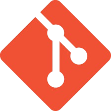
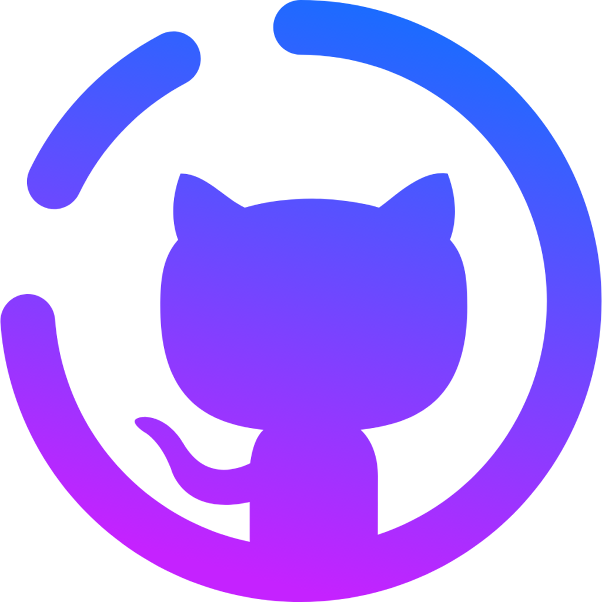

<h1 align="center" style="border-bottom: none">
    👋 Seja bem-vindo!<br>
</h1>

---
Meu nome é Robson Ferreira e sou um ```Engenheiro Devops```</strong>.<p>

O mercado de trabalho atual exige profissionais ```capacitados```, que dominem as ferramentas mais modernas de automação, integração e infraestrutura em nuvem. E mais do que isso: profissionais valorizados e ```altamente remunerados```, capazes de entregar soluções ```ágeis, seguras e escaláveis```.

**Implementar pipelines**, **automatizar infraestrutura**, **monitorar sistemas** e **entregar aplicações em escala**, utilizando as ferramentas que moldam o ```DevOps moderno``` são funções fundamentais de um profissional Devops.

Nesse espaço, eu pretendo compartilhar alguns projetos relacionados como:

  <table border="0">
    <tr>
      <td style="text-align: right;">
      
      
      </td>
      <td>Trabalhar com os principais provedores de nuvem.</td>
    </tr>
    <tr>
      <td> Operar o Sistema Operacional Linux, utilizado <br>pela maioria dos servidores e containers.</td>
    <td></td>
    </tr>
    <tr><center>
      <td style="text-align: right;"></td></center>
      <td>Automatizar a criação e gestão de infraestrutura como código..</td>
    </tr>
    <tr>
      <td>Realizar configurações automáticas<br> e orquestra servidores com eficiência.</td>
    <td></td>
    </tr>
    <tr>
      <td style="text-align: right;"></td>
      <td>Cria ambientes portáteis e reproduzíveis com containers.</td>
    </tr>
    <tr>
      <td>Gerenciar e escalar aplicações <br>em containers de forma automatizada.</td>
    <td></td>
    </tr>
    <tr>
      <td style="text-align: right;"></td>
      <td>Coletar e armazenar métricas para monitoramento.</td>
    </tr>
    <tr>
      <td>Criar dashboards visuais e interativos para análise de métricas.</td>
    <td></td>
    </tr>
    <tr>
      <td style="text-align: right;"></td>
      <td>Automatizar tarefas do sistema de forma prática e poderosa.</td>
    </tr>
    <tr>
      <td>Linguagem versátil para automação, integração e manipulação de dados.</td>
    <td></td>
    </tr>
    <tr>
      <td style="text-align: right;">
      </td>
      <td>Automatizar o processo de compilação, testes e empacotamento de aplicações</td>
    </tr>
    <tr>
      <td>Criar documentação técnica.</td>
    <td></td>
    </tr>
    <tr>
      <td style="text-align: right;"></td>
      <td>TRabalhar com um sistema de controle de versão distribuído que permite registrar, acompanhar e coordenar alterações em arquivos de projetos, especialmente de código-fonte.</td>
    </tr>
    <tr>
      <td>Pipeline CI/CD -  Integrar, testar e entregar aplicações de forma contínua, garantindo agilidade e qualidade no desenvolvimento de software</td>
    <td>
  
  </td>
    </tr>
  </table>

---

<br><br>
<h4 align="center" style="border-bottom: none">
    <a href="./devops/cultura.md">,🚀 PRESS START 🚀</a>
</h4>